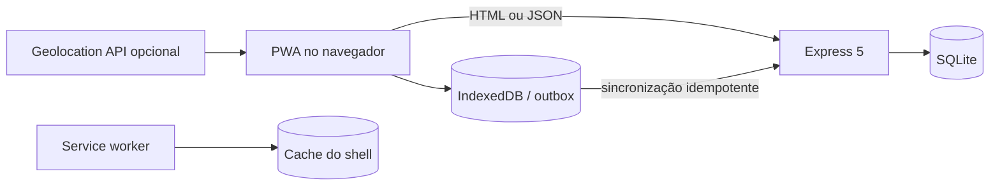

# Requisitos e arquitetura

## Requisitos funcionais iniciais

| ID | Requisito | Evidência |
|---|---|---|
| RF01 | criar ficha com checklist | formulário e `POST /api/inspecoes` |
| RF02 | consultar fichas sincronizadas | listagem, filtros e API |
| RF03 | registrar pontos de atenção | itens normalizados no banco |
| RF04 | guardar envio durante falha de rede | object store `outbox` no IndexedDB |
| RF05 | reenviar sem duplicar | `client_id` único e retorno idempotente |
| RF06 | registrar posição opcional | Geolocation API acionada por botão |
| RF07 | atualizar andamento | formulário e endpoint de status |

## Requisitos não funcionais

- interface entre 320 px e desktop;
- navegação por teclado e foco visível;
- shell essencial disponível após primeira visita;
- consultas SQL parametrizadas;
- payload limitado a 40 KB;
- falha de sincronização não descarta ficha;
- API retorna erros estruturados;
- CI executa checagem e testes.

## Arquitetura

## Modelo de dados

Uma inspeção possui os quatro itens canônicos do checklist, com códigos únicos. `client_id` é opcional no cadastro tradicional e obrigatório na fila offline. A tabela `inspecoes_submetidas` registra o hash do conteúdo inicial junto da criação, na mesma transação. Reenvio idêntico é reconhecido; conteúdo alterado sob a mesma chave retorna `409`. O status operacional pode mudar sem modificar o recibo inicial. Registros antigos sem recibo são preservados e exigem comparação manual, sem backfill.

No cliente, IndexedDB confirma a transação antes de anunciar salvamento. Uma confirmação do servidor só remove a fila quando o conteúdo local ainda é o enviado; edição concorrente mais recente não é descartada. Revisão offline, exportação JSON e estados de falha são acessíveis pelo painel local. Fichas abertas para revisão não participam do envio automático até o usuário salvar.

## Limites arquiteturais

O IndexedDB pertence ao perfil do navegador e não é backup. Limpeza de dados do site remove a fila. Vários dispositivos não compartilham rascunhos. O service worker não substitui autenticação, sincronização de conflitos ou observabilidade de produção.
